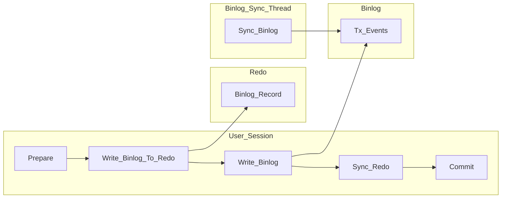

# Logging

## Redo log

事务提交时，先写重做日志再修改页（WAL，write ahead log 策略），当由于发生宕机而导致数据丢失时，就可以通过重做日志来完成数据的恢复。然后，按一定频率刷新到重做日志文件。

## Undo log

保存事务持久化前数据的样子，undo log有两个作用：提供回滚和多个行版本控制(MVCC)。

## Binlog

Binlog 用于记录数据库执行的写入性操作(不包括查询)信息，以二进制的形式保存在磁盘中。

## Binlog 与 Undo&Redo 的不同

* **操作的范围不同**，Binlog 会记录所有与MySQL数据库有关的日志记录，包括InnoDB、MyISAM等其他存储引擎的日志。而InnoDB存储引擎的 Redo 日志只记录有关该存储引擎本身的事务日志。
* **记录的内容不同**，无论用户将 Binlog 记录的格式设为 STATEMENT、ROW 或 MIXED，其记录的都是关于一个事务的具体操作内容，即该日志是逻辑日志。而 Redo log 记录的是关于每个页的更改的物理情况。
* **写入的时间点不同**，Binlog 仅再事务提交前进行提交，即只写磁盘一次，不论这时该事务多大。而在事务进行的过程中，却不断有重做日志条目(Redo entry)被写入到重做日志文件中。

binlog 日志只用于归档，只依靠binlog 是没有 crash-safe 能力的。但只有 redo log 也不行，因为 redo log 是InnoDB特有的，且日志上的记录落盘后会被覆盖掉。因此需要 binlog 和 redo log 二者同时记录，才能保证当数据库发生宕机重启时，数据不会丢失。

# Commit

## 2PC 二阶段提交

为了性能考虑，每次提交事务的时候，只需要将 Redo 和 Undo 刷下去就代表事务已经持久化了，而不需要等待数据落盘。由于 Undo 的信息也会写入 Redo，所以其实我们只需要根据 Redo 是否刷下去而决定崩溃时是重做还是回滚。

开启 Binlog 后，还需要考虑 Binlog 是否落盘（Binlog牵扯到主从数据一致性，全备恢复的位点）。根据事务是否成功写 Binlog 决定事务的重做还是回滚。

### 两个阶段

* `prepare` 阶段，将 Redo 日志持久化到磁盘，并将回滚段置为prepared状态，此时 Binlog 不做操作。

	

* `commit` 阶段，设置提交状态，binlog持久化到磁盘，然后存储引擎层提交。

	

> 2PC 保证了事务在引擎层（redo）和 server 层（binlog）之间的原子性。其中 binlog 作为XA协调器，即以 binlog 是否成功写入磁盘作为事务提交的标志（innodb commit 标志并不是事务成功与否的标志）。所以在崩溃恢复中也是以 redo log 中的 xid 与 binlog 中的 xid 进行比较，如果 xid 在 binlog 中则提交，否则回滚。

### 崩溃恢复 (no Binlog)

由于未提交的事务和已回滚的事务也会记录到 Redo log 中，因此在进行恢复的时候，这些事务要进行特殊的处理。进行恢复时，从checkpoint开始，重做所有事务（包括未提交的事务和已回滚的事务），然后通过 Undo log 回滚那些未提交的事务。

### 崩溃恢复 (with Binlog)

1. 扫描最后一个 Binlog，提取 xid（标识 Binlog 中的第几个event）
2. xid 也会写到 Redo 中，将 Redo 中 prepare 状态的 xid，去跟最后一个 Binlog 中的 xid 比较 ，如果 Binlog 中存在，则提交，否则回滚。

> 为什么只扫描最后一个 Binlog？因为 Binlog rotate 的时候会把前面的 Binlog 都刷盘，而且事务是不会跨 Binlog 的。
>
> 
>
> 具体的，这个函数将最后一个 binlog 中完整写入的事务 XID 添加到一个 hash，这些 XID 标志着对应的事务已经完成。实现上，遍历并解析 binlog 文件中的每个 event，遇到 XID-event 时，将其中的 xid 提取出来并加入 hash。
>
> 接下来，通过 handler 接口中的 ha_recover 函数将这个 hash 传递给 InnoDB，以此告诉 InnoDB 哪些事务需要回滚。
>
> 在 InnoDB 拿到这个 hash 后，首先调用 innobase_xa_recover 函数得到 InnoDB 中处于 prepared 状态的 xid 集合，然后遍历其中每个 prepared 状态的事务，确定是否需要回滚

## Group Commit

若事务为非只读事务，则每次事务提交时需要进行一次刷数据的操作，以此保证重做日志都已经写入磁盘。

日志的写入基本上是顺序IO。WAL(Write-Ahead-Logging) 用顺序的日志写入代替数据的随机IO实现事务持久化。但是尽管如此，每次事务提交都需要日志刷盘，仍然受限于磁盘IO。group commit 的出现就是为了将日志（Redo/Binlog）刷盘的动作合并，从而提升 IO 性能

### 事务提交顺序

2PC机制只能解决单个事务的 Redo/Binlog 顺序一致的问题，但是对于并发事务还需要一些调整

如上图，事务按照T1、T2、T3顺序开始执行，将二进制日志（按照T1、T2、T3顺序）写入日志文件系统缓冲，调用 fsync() 进行一次 group commit 将日志文件永久写入磁盘，但是存储引擎提交的顺序为T2、T3、T1。当T2、T3提交事务之后，若通过在线物理备份进行数据库恢复来建立复制时，因为在 InnoDB 存储引擎层会检测事务T3在上下两层都完成了事务提交，不需要在进行恢复了，此时主备数据不一致 

MySQL 的内部 XA 机制保证了单个事务在 binlog 和 InnoDB 之间的原子性，接下来我们需要考虑，在多个事务并发执行的情况下，怎么保证在 binlog 和 redolog 中的顺序一致？

### 解决方法 一 —— 上锁

对每个事务的 commit 过程上锁，只有当上一个事务 commit 后释放锁，下个事务才可以进行 prepare 操作，这样完全串行化的执行保证了顺序一致。

问题是互斥的操作导致了严重的冲突，同时没能做到 group commit 的优点。

### 解决方法 二 —— 合并提交

为了提高并发性能，肯定要细化锁粒度。

2PC中的prepare阶段，会对redo进行一次持久化操作，这时候redo group commit的过程如下：

1. 获取 log_mutex
2. 若 flushed_to_disk_lsn >= LSN，表示日志已经被刷盘,跳转5
3. 若 current_flush_lsn >= LSN，表示日志正在刷盘中，跳转5后进入等待状态
4. 将小于 LSN 的日志刷盘(flush and sync)
5. 退出 log_mutex

这个过程是根据 LSN 的顺序进行合并的，也就是说一次 redo group commit 的过程可能会将别的未提交事务中的 LSN 也一并刷盘

binlog 的组提交，prepare 阶段不变，只针对 commit 阶段，将 commit 阶段拆分为三个过程：

1. flush stage：多个线程按进入的顺序将 binlog 从 cache 写入文件（不刷盘）；
2. sync stage：对 binlog 文件做 fsync 操作（多个线程的 binlog 合并一次刷盘）；
3. commit stage：各个线程按顺序做 commit 操作。

其中，每个阶段有 lock 进行保护，因此保证了事务写入的顺序。

> Group Commit技术将事务的提交阶段分成了Flush、Sync、Commit三个阶段，每个阶段维护一个队列，并且由该队列中第一个线程负责执行该步骤，这样实际上就达到了一次可以将一批事务的Binlog fsync到磁盘的目的，这样的一批同时提交的事务称为同一个Group的事务。
>
> 

这种实现机制的巧妙之处在于：**同一组提交的事务之间是不冲突的，因此可以并行回放**

为了标记事务所属的组，MySQL5.7版本在产生Binlog日志时会有两个特殊的值记录在 Binlog Event 中，last_committed 和 sequence_number，其中 last_committed指的是该事务提交时，上一个事务提交的编号，sequence_number是事务提交的序列号，在一个Binlog文件内单调递增。如果两个事务的last_committed值一致，这两个事务就是在一个组内提交的。

### 解决方法 三 —— 延迟 Redo log

二中每个事务各自做 prepare 并写 redo log，只有到了 commit 阶段才进入组提交，因此每个事务的 redo log sync 操作成为性能瓶颈。

在二的基础上修改组提交的 flush 阶段，在 prepare 阶段不再让线程各自执行 flush redo log 操作，而是推迟到组提交的 flush 阶段，flush stage 修改成如下逻辑：

1. 收集组提交队列，得到 Leader 线程，其余 follower 线程进入阻塞；
2. Leader 一次将所有线程的 redo log 刷盘；
3. 将队列中线程的所有 binlog cache 写到 binlog 文件中。

这个优化是将 redo log 的刷盘延迟到了 binlog group commit 的 flush stage 之中，sync binlog 之前。通过延迟写 redolog 的方式，为 redo log 做了一次组写入，这样 binlog 和 redo log 都进行了优化。

## 并行复制

> MySQL最早的主备复制只有两个线程，IO 线程负责从主库接收 binlog 日志，并保存在本地的 relaylog 中，SQL线程负责解析和重放 relaylog 中的 event。当主库并行写入压力较大时，备库 IO 线程一般不会产生延迟，因为写 relaylog 是顺序写，但是 SQL 线程重放的速度经常跟不上主库写入的速度，会造成主备延迟。如果延迟过大，relaylog 一直在备库堆积，还可能把磁盘占满。

### Schema 级别的并行复制

开启并行复制后，会启动多个 Worker 线程，原有的 SQL 线程变为 Coordinator 线程。

可以并行的事务分发给 Worker 线程执行；不能并行的事务等待 Worker 线程全部结束后，再由 Coordinator 线程自己执行。

这种并行复制的模式，对于多个 DB 同时更新才能有较高的并行度，但是更常见的情况是更新集中在同个一个 DB。

把 Schema 级别的并行复制改成 Table 级别，可以大幅度提高单库多表环境下的并行度。但是对于只有一个热点表的情况依然处理不了。

### 基于 Group Commit 的并行复制

这种实现机制的巧妙之处在于：**同一组提交的事务之间是不冲突的，因此可以并行回放**

引入 Group Commit 之前，Binlog 和 InnoDB 中的日志提交是串行提交的（如在 prepare 阶段提交 Redo 日志，在 commit 阶段才提交 Binlog）

但是引入 Group Commit 后，将其分为了三个阶段，可以并发执行。同时写 Binlog 和 InnoDB commit 都是按照队列中的顺序，可以保证 Binlog 和事务提交顺序一致。

> 这里的并行复制还有一点点弊端，如果如果主库并行度低，那么备库回放时也很难并行。
>
> - 设置等待延迟提交的时间，Binlog 提交后等待一段时间再 fsync。让每个 group 的事务更多，人为提高并行度。
> - 设置等待提交的最大事务数，如果等待时间没到，而事务数达到了，就立即 fsync。达到期望的并行度后立即提交，尽量缩小等待延迟。
>
> 其他优化：
>
> 即使主库在串行提交的事务，只有互相不冲突，在备库就可以并行回放。

缺点：每组提交事务要足够多。当业务量比较小，并发度不够时，并行复制依然会退化为单线程复制。

### 基于 WriteSet 的并行复制

简单来说，WriteSet并行复制的思想是：**不同事务的不同记录不重叠，则都可在从机上并行回放**，可以看到并行的力度从组提交细化为记录级。

具体实现来看：

WriteSet 可以是将每条记录 Hash 后的值，产生的 WriteSet 对象会插入到WriteSet 哈希表。

当事务每次提交时，会计算修改的每个行记录的WriteSet值，然后查找哈希表中是否已经存在有同样的WriteSet，若无，WriteSet 插入到哈希表，写入二进制日志的 last_committed 值不变。若有，则 last_committed 值更新为 sequnce_number。

回放时和基于组提交的并行复制一样，具有相同的 last_committed 值可以并行回放，但是由于是基于WriteSet机制的，因此不同的记录能并行执行。同一条记录回放，last_committed值必然不同，必须等待之前的一条记录回放完成后才能执行。

# Binlog in Redo

如上图所示，在事务的提交过程中有两次存储IO的写操作。第一次是 Redo 的写操作，将事务的Prepare 状态持久化。第二次是 Binlog 的写操作，将事务的 Binlog Events 持久化。

Binlog in Redo 尝试将其压缩为一次 IO 过程。它去掉了 Binlog Sync，将 Binlog 写入 Redo log 中。

* 当事务提交时，将事务的 Binlog Events 写入到 Redo 中，然后将 Redo 持久化。
* 而 Binlog 文件则采用异步的方式，用单独的线程周期性的持久化到存储中。
* 在主机宕机发生时，Binlog 中可能会丢失 Binlog Events. 重新启动时，Recovery过程会用 Redo Log中的Binlog Events来补齐Binlog文件。

这个设计从数据保护上保持了双1配置的含义，从性能上则去掉了Binlog的刷盘。