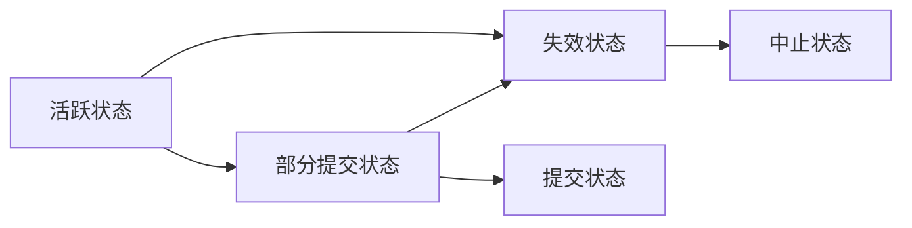

# 事务的概念

**事务** 是访问并可能更新各种数据项的一个程序执行单元。简单的说，一个事务是这么一种操作，要么能够完成，要么不引起任何影响。

&nbsp;

# 事务的状态

事务必须处于以下状态之一：

* **活跃** `Active`：事务执行时的初始状态
* **部分提交** `Partially commited`：在最后一条语句执行之后
* **失效** `Failed`：发现正常执行不能再继续下去
* **中止** `Aborted`：在事务已经回滚并且数据库已经恢复到原先状态之后
* **提交** `Commited`：成功完成之后




**终止** `Terminated` 当一个事务要么是提交的，要么是中止的，即为终止状态

&nbsp;

# 事务的属性

事务需要具有 `ACID` 属性：

## **原子性** `Atomicity`
事务的所有操作在数据库中要么全部正确反映出来，要么完全不反映

> 保证原子性的基本思想是：数据库系统记录事务要执行写操作的任何数据项的旧值。这种东西记录在一个 *日志* 中。当事务未能完成其执行，恢复系统可以从日志中恢复出旧值。

事务并非总能成功执行，这种事务被称为 **中止** `Aborted` 了。而成功完成其执行的事务被称为 **已提交** `Commited`。

为了保证原子性，中止的事务必须不对数据库的状态造成影响，其做过的任何改变也需要撤销。一旦中止的事务造成的变更被撤销，我们称其为 **回滚** `Rolled back`

管理事务中止是恢复机制的职责之一，一种典型的方式是维护一个 **日志** `Log`。当事务被中止，此时系统有两种选择：**重启事务** 或者 **杀死事务**。

但是一旦事务被提交，不能够通过中止来撤销其造成的影响，只能通过 **补偿事务** `Compensating transaction` 来弥补。


## **一致性** `Consistency`
以隔离的方式执行事务以保持事务的一致性


## **隔离性** `Isolation`
尽管多个事务可能并发执行，但是需要保证，对于每个事务，其运行时不需关心其他事务的运行情况。确保隔离性是数据库系统中 *并发控制系统* 的责任。

当事务是 **串行** 执行时，事情会简单很多。

> 事务 **并行** 的理由：
>
> * 提高吞吐量和资源利用率
> * 减少等待时间。

当事务是 **并行** 的时候，系统通过 **并发控制机制**(Concurrent-control scheme) 的一系列机制来做到这一点。我们通过保证所执行的任何调度的效果都与没有任何并发执行的调度效果是一样的，来保证数据库的一致性。这种调度称为 **可串行化的**(Serializable) 调度。

当事务失效时，需要撤销其影响以确保该事务的原子性。这里从事务失效的角度讨论如何的调度是可接受的

* **可恢复调度**

	对于每对事务 $T_i$ 和 $T_j$ ，如果 $T_j$ 读取了由 $T_i$ 之前所写过的数据项，则 $T_i$ 的提交操作出现在 $T_j$ 的提交操作之前。

* **无级联调度**

	因为单个事务失败而导致的一系列事务回滚的现象称为 **级联回滚**

	**无级联调度**是指：对于每对事务 $T_i$ 和 $T_j$ 都满足如果 $T_j$ 读取了先前由 $T_j$ 所写的一个数据项，则 $T_i$ 的提交操作必须出现在 $T_j$ 的这一个读操作之前。


## **持久性** `Durability`
当一个事务完成之后，它对数据库的改变是永久的，即使出现系统故障也是如此。通过确保以下任一条来保证持久性：

* 由事务所执行的更新在事务结束之前就已经写入磁盘
* 有关事务已经执行的更新信息已经被写入磁盘，足以是的恢复系统正常工作。

&nbsp;

# 事务读写模型

这里只考虑两种事务操作 `read`、`write`。同时这里每个数据项只包含单个数据值，每个数据项通过名字来识别。

* `read`：从数据库把数据项 X 传送给一个也称为 X 的变量，X 位于属于执行 `read` 操作的事务的主存缓冲区中
* `write`：从执行 `write` 的事务的主存缓冲区中把变量 X 的值传送给数据库中的 X 数据项。

> 知道一个数据项的变化是否只出现在主存中或者是否已经写入到磁盘是十分重要的。在实际的数据库中，写入操作不一定导致磁盘上数据的立即更新。


考虑 `read` 和 `write` 操作的 **冲突可串行化**(Conflict serializable)：

一个调度 $S$ ，其中含有分别属于事务 $T_i$ 和 $T_j$ 的两条连续指令 I 和 J，考虑四种情况：

1. I = read(Q)，J = read(Q)：I 和 J 的次序无关紧要。
2. I = read(Q)，J = write(Q)：若 I 先于 J，则 $T_i$ 不会读到 $T_j$ 写入的 Q 值；反之，$T_i$ 读到的是 $T_j$ 写入的 Q 值。
3. I = write(Q)，J = read(Q)：同上。
4. I = write(Q)，J = write(Q)：这两条指令的次序对彼此并不会有影响，但是对于之后的下一条 read 指令会有影响。

> 若 I 和 J 是属于不同事务的指令且 I 和 J 并不冲突，则可以交换二者的顺序来形成一个新的调度 $S'$
>
> 如果调度 $S$ 能够经过一系列的非冲突指令的交换得到调度 $S'$ ，则称二者是 **冲突等价的**

可以考虑建立调度的有向图 **优先图**(Precedence graph)，通过 **拓扑排序** 得到 **可串行化次序**

&nbsp;

# 事务插入删除模型

## 删除

要理解删除指令如何影响并发控制的，需要弄清楚删除指令何时与另一个指令发生冲突，令 $I_i = delete(Q)$ ：

* $I_j$ = read(Q)，发生冲突。如果 $I_i$ 出现在 $I_j$ 之前，则 $T_j$ 将出现逻辑错误；如果 $I_i$ 出现在 $I_j$ 之后，则 $T_j$ 可以成功执行 read 操作。 
* $I_j$ = write(Q)，发生冲突。如果 $I_i$ 出现在 $I_j$ 之前，则 $T_j$ 将出现逻辑错误；如果 $I_i$ 出现在 $I_j$ 之后，则 $T_j$ 可以成功执行 write 操作。 
* $I_j$ = delete(Q)，发生冲突。如果 $I_i$ 出现在 $I_j$ 之前，则 $T_j$ 将出现逻辑错误；如果 $I_i$ 出现在 $I_j$ 之后，则 $T_i$ 出现逻辑错误。
* $I_j$ = insert(Q)，发生冲突。 

总结如下：

* 在两阶段封锁协议下，在一个数据项可以被删除之前，需要获得该数据项上的排他锁。
* 在时间戳排序协议下，必须执行类似于为 write 操作所进行的测试。假如事务 $T_i$ 发出 delete(Q)：
	- 如果 TS($T_i$) < R-timestamp($Q$)，则 $T_i$ 将要删除的 $Q$ 值已被满足 TS($T_j$) > TS($T_i$) 的事务 $T_j$ 读取。因此，delete 操作被拒绝，并且 $T_i$ 回滚。
	- 如果 TS($T_i$) < W-timestamp($Q$)，则满足 TS($T_j$) > TS($T_i$) 的事务 $T_j$ 已经写过 $Q$。因此这个 delete 操作被拒绝，并且 $T_i$ 回滚。
	- 否则执行 delete 操作。

## 插入

在一个数据项存在之前不能对它执行 read 或 write 操作：

* 在两阶段封锁协议下，如果 $T_i$ 执行 insert($Q$) 操作，那么 $T_i$ 在新创建的数据项 $Q$ 上被赋予排他锁。
* 在时间戳排序协议下，如果 $T_i$ 执行 insert($Q$) 操作，那么 R-timestamp($Q$) 与 W-timestamp($Q$) 的值被设置为 $TS(T_i)$

&nbsp;

# 事务的隔离性级别

保证可串行性的协议可能只允许较小的并发度。在这种情况下，可以采用较弱级别的一致性，但是同时需要保证数据库的正确性。

事务的 **隔离性级别**(Isolation level)

* **可串行化 `Serializable`**

	通常保证可串行化的执行。但是一些数据库系统某些情况下允许非可串行化执行的方式来实现这种隔离级别

* **可重复读 `Repeatable read`**

	只允许读取已提交的数据，并进一步要求在一个事务两次读取一个数据项期间，其他事务不得更新该数据项

* **已提交读 `Read commited`**

	只允许读取已提交的数据，当不要求可重复读

* **未提交读 `Read uncommited`**

	允许读取未提交数据

> 以上的隔离性级别附带都不允许 **脏写 `dirty write`**，即如果一个数据线已经被另外一个尚未提交或中止的事务写过，则不允许对该数据项再执行写操作。

&nbsp;

## 谓词读和幻像

考虑事务 $T_1$ ，它在大学数据库上执行 SQL 查询：

```mysql
select count(*)
from instructor
where dept_name = 'Physics'
```

事务 $T_1$ 需要访问 *instructor* 关系中属于物理组的所有元组。

令 $T_2$ 为一个执行以下 SQL 插入的事务：

```mysql
insert into instructor
	values(11111, 'Feynman', 'Physics', 94000)
```

令 $S$ 为一个对应的调度：

* 如果 $T_1$ 在计算 count(*) 时使用了 $T_2$ 新插入的元组，则 $T_1$ 就读取了被 $T_2$ 写入的一个值，因此在等价于 $S$ 的串行调度中，$T_2$ 必须先于 $T_1$
* 如果 $T_1$ 在计算 count(*) 时并未使用 $T_2$ 新插入的元组，则在等价于 $S$ 的串行调度中，$T_1$ 必须先于 $T_2$

第二中情况所防止的即为 **幻象现象 `phantom phenomenon`**，其根源在于谓词读取与插入或者更新相冲突，从而导致新/更新元组满足谓词。

仅仅封锁要访问的元组是不够的，还必须封锁用来找到被事务锁访问的元组的信息。